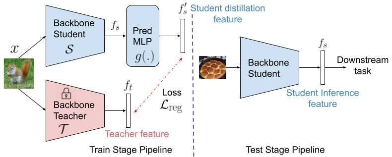

# SimReg: A Simple Regression Based Framework for Self-supervised Knowledge Distillation

Source code for the [paper](https://www.bmvc2021-virtualconference.com/assets/papers/1137.pdf) "SimReg: Regression as a Simple Yet Effective Tool for Self-supervised Knowledge Distillation".\
Paper accepted at _British Machine Vision Conference (BMVC), 2021_

## Overview

We present a simple framework to improve performance of regression based knowledge distillation from self-supervised teacher networks. The teacher is trained using a standard self-supervised learning (SSL) technique. The student network is then trained to directly regress the teacher features (using MSE loss on normalized features). Importantly, the student architecture contains an additional multi-layer perceptron (MLP) head atop the CNN backbone during the distillation (training) stage. A deeper architecture provides the student higher capacity to predict the teacher representations. This additional MLP head can be removed during inference without hurting downstream performance. This is especially surprising since only the output of the MLP is trained to mimic the teacher and the backbone CNN features have a high MSE loss with the teacher features. This observation allows us to obtain better student models by using deeper models during distillation without altering the inference architecture. The train and test stage architectures are shown in the figure below.



## Requirements

All our experiments use the PyTorch library. We recommend installing the following package versions:
- python=3.7.6
- pytorch=1.4
- torchvision=0.5.0
- faiss-gpu=1.6.1 (required for k-NN evaluation alone)

Instructions for PyTorch installation can be found [here](https://pytorch.org/). 
GPU version of the FAISS package is necessary for k-NN evaluation of trained models. It can be installed using the following command:
```shell
pip install faiss-gpu
```

## Dataset

We use the ImageNet-1k dataset in our experiments. Download and prepare the dataset using the [PyTorch ImageNet training example code](https://github.com/pytorch/examples/tree/master/imagenet). The dataset path needs to be set in the bash scripts used for training and evaluation.

## Training

Distillation can be performed by running the following command:
```shell
bash run.sh
```
Training with ResNet-50 teacher and ResNet-18 student requires nearly 2.5 days on 4 2080ti GPUs (~26m/epoch). The defualt hyperparameters values are set to ones used in the paper. Modify the teacher and student architectures as necessary. Set the approapriate paths for the ImageNet dataset root and the experiment root. The current code will generate a directory named ```exp_dir``` containing ```checkpoints``` and ```logs``` sub-directories.

## Evaluation

Set the experiment name and checkpoint epoch in the evaluation bash scripts. The trained checkpoints are assumed to be stored as ```exp_dir/checkpoints/ckpt_epoch_<num>.pth```. Edit the ```weights``` argument to load model parameters from a custom checkpoint. 

### k-NN Evaluation

k-NN evaluation requires FAISS-GPU package installation. We evaluate the performance of the CNN backbone features. Run k-NN evaluation using:
```shell
bash knn_eval.sh
```
The image features and results for k-NN (k=1 and 20) evaluation are stored in ```exp_dir/features/``` path. 

### Linear Evaluation

Here, we train a single linear layer atop the CNN backbone using an SGD optimizer for 40 epochs. The evaluation can be performed using the following code:
```shell
bash lin_eval.sh
```
The evaluation results are stored in ```exp_dir/linear/``` path. Set the ```use_cache``` argument in the bash script to use cached features for evaluation. Using this argument will result in a single round of feature calculation for caching and 40 epochs of linear layer training using the cached features. While it usually results in slightly reduced performance, it can be used for faster evaluation of intermediate checkpoints.

## Pretrained Models

To evaluate the pretrained models, create an experiment root directory ```exp_dir``` and place the checkpoint in ```exp_dir/checkpoints/```. Set the ```exp``` argument in the evaluation bash scripts to perform k-NN and linear evaluation. We provide the pretrained teacher (obtained using the officially shared checkpoints for the corresponding SSL teacher) and our distilled student model weights. We use cached features of the teacher in some of our experiments for faster training. 

| Teacher | Student | 1-NN | Linear |
| ------- | ------- | ---- | ------ |
| [MoCo-v2 ResNet-50](https://dl.fbaipublicfiles.com/moco/moco_checkpoints/moco_v2_800ep/moco_v2_800ep_pretrain.pth.tar) | [MobileNet-v2](https://drive.google.com/drive/folders/1sxd0dmgVDxqGCgg1BaOOWCT3aQHwSMqu?usp=sharing) | 55.5 | 69.1 |
| MoCo-v2 ResNet-50 | [ResNet-18](https://drive.google.com/file/d/1rKWBf5Tf9lsCbz-aJz30otIQWFMsnICX/view?usp=sharing) | 54.8 | 65.1 |
| [SimCLR ResNet-50x4](https://drive.google.com/file/d/1fZ2gfHRjVSFz9Hf2PHsPUao9ZKmUXg4z/view?usp=sharing) | [ResNet-50 (cached)](https://drive.google.com/file/d/1R_Ljmd9GMAtUTwLtM61r_cngqVsaQUFh/view?usp=sharing) | 60.3 | 74.2 |
| [BYOL ResNet-50](https://drive.google.com/file/d/1AN2XGuXat2OHDPNPR5E-j2znbhy5n6YS/view?usp=sharing) | [ResNet-18 (cached)](https://drive.google.com/file/d/19_q_je5p2ItPv47yvVVqLy4wL46nagRn/view?usp=sharing) | 56.7 | 66.8 |
| [SwAV ResNet-50 (cached)](https://dl.fbaipublicfiles.com/deepcluster/swav_400ep_bs256_pretrain.pth.tar) | [ResNet-18](https://drive.google.com/file/d/1eW0aCdqctm4hTXIuxyxNFc6rrQFUcYsu/view?usp=sharing) | 54.0 | 65.8 |

## Citation

If you make use of the code, please cite the following work:
```
@inproceedings{navaneet2021simreg,
 author = {Navaneet, K L and Koohpayegani, Soroush Abbasi and Tejankar, Ajinkya and Pirsiavash, Hamed},
 booktitle = {British Machine Vision Conference (BMVC)},
 title = {SimReg: Regression as a Simple Yet Effective Tool for Self-supervised Knowledge Distillation},
 year = {2021}
}
```

## License

This project is under the MIT license.
